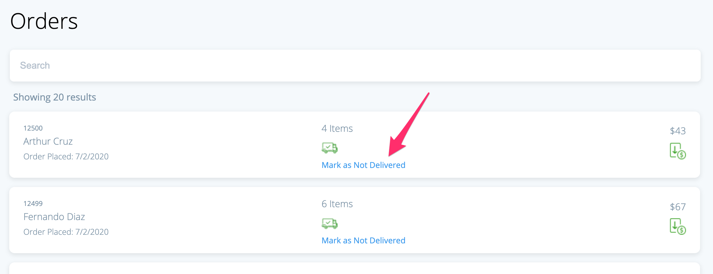

# Back-office orders challange

In this challange, you will extend and add new features to a back-office orders management system. 
It combines building UI components and a touch of server development as well.

## Technology stack
- Git / GitHub
- Javascript / TypeScript
- HTML & CSS
- React
- Node.js / Express.js

## Before you start

The current base code is far from perfect. While you complete the following tasks, try to improve the existing code. The system should be **scalable**, and should support different screens and devices.

### Part A - List content:

1. We added a button for changing the delivery status, but it doesn’t seem to do anything. Please fix it.
   
1. Our call center asked us for more data on each order. Find a UX solution and implement it. They want to see the following when clicking on an item:
	1. Name and quantity of the ordered items
	1. Images of the items (or an image of the most expensive item)
	1. The exact time of the order

### Part B - Search and filters:

1. We are showing the last 20 orders. The rumor in the call centers says there are a lot more. Please fix this.

2. The simple search we provide isn’t enough. We need to add an ability to search for item names as well.

3. **[BONUS]** - Add an ability to filter orders by fulfillment and payment status.

### Part C - Your personal touch:

Think of a small addition to this project and make it happen. It should involve adding something to the UI, or server (or both!). A good rule of thumb for the effort here is that it should not exceed the time that it took you to perform Part B.
Please describe the feature you've added on your email back to us

Note: this step is also mandatory.

### Part D - Bonus mission

One of the things that really important to our users is to know the number of orders that still didn't deliver (orders with a status of not deliver)
Think of a nice way to display, and keep it updated 

